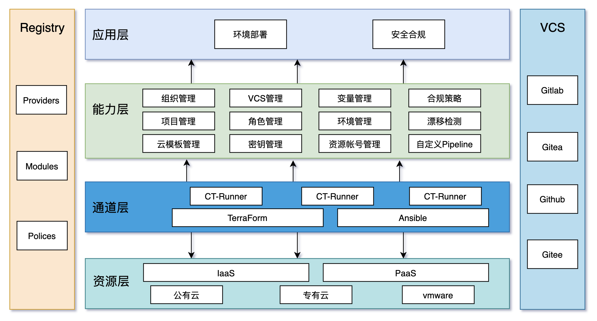

<h1 align="center">CloudIaC</h1>
<h3 align="center">开源基础设施即代码环境管理平台</h3>
<p align="center">
  <a href="https://github.com/idcos/cloudiac"></a>
  <a href="https://idcos.github.io/cloudiac"></a>
  <a href="https://github.com/idcos/cloudiac/releases"></a>
  <a href="https://github.com/idcos/cloudiac/releases/latest"></a>
  <a href="https://github.com/idcos/cloudiac"></a>
</p>
<hr />

CloudIaC 是基于基础设施即代码构建的云环境自动化管理平台。

CloudIaC 将易于使用的界面与强大的治理工具相结合，让您和您团队的成员可以快速轻松的在云中部署和管理环境。

通过将 CloudIaC 集成到您的流程中，您可以获得对组织的云使用情况的可见性、可预测性和更好的治理。

### CloudIaC 的功能

-   **环境即服务**: 通过Terraform和Ansible的结合，以代码交付基础设施和应用，使用VCS来管理并控制代码的版本，一份代码对应一套或多套环境；
-   **安全合规**: 融合OPA（Open Policy Agent）引擎，以策略即代码的方式对即将创建的基础设施进行合规检查，在安全风险和错误配置发生之前尽量降低它们；
-   **漂移检测**: 及时发现配置漂移的发生，接收漂移发生的通知并通过资源拓扑直观呈现漂移数据；
-   **费用统计及预估**: 公有云环境月度费用统计，掌握云端环境资源整体费用及占比情况，同时可在资源创建及删除时给出费用预估。

### CloudIaC 的优势

-   **开源**：完全开源、兼容开源，基于 Terraform 生态构建环境即服务；
-   **全生命周期**：从环境资源的供给、应用自动部署、配置变更到环境销毁，覆盖整个资源及应用的完整生命周期；
-   **持续部署**：通过 Pipeline 无缝对接 CI 工具，将部署融入持续交付和 DevOps 体系；
-   **团队协作**：团队协作管理环境，支持不同管理层级角色授权。

### 功能架构



### 在线体验

> CloudIaC 体验云服务（Beta）即将推出，敬请期待！

### 快速开始

快速安装部署 CloudIaC：

1.  准备一台 Linux 主机，安装 docker 、docker-compose；
2.  以 root 用户执行如下命令一键部署 CloudIaC。

```sh
curl -fsSL https://raw.githubusercontent.com/idcos/cloudiac-docs/master/script/cloudiac-docker.sh | bash
```

文档和演示视频：

-   [完整文档](https://docs.cloudiac.org/)
-   [视频介绍](https://space.bilibili.com/2138433328/channel/seriesdetail?sid=1908688)

### 社区

如果您在使用过程中有任何疑问或建议，欢迎提交 [GitHub Issue](https://github.com/idcos/cloudiac/issues/new/choose) 或加入我们的社区进一步交流沟通。

项目官网: https://www.cloudiac.org/

#### 微信交流群
欢迎加入CloudIaC开源技术交流群：

微信群超过200人无法扫码进入，请添加CloudIaC助手为好友，助手将邀请您进群


### 技术栈

-   后端: [Golang](https://go.dev/)
-   前端: [React](https://reactjs.org/)
-   中间件: [MySQL](https://www.mysql.com/), [Kafka](https://kafka.apache.org/), [Consul](https://www.consul.io/)
-   基础设施: [Docker](https://www.docker.com/), [Kubernetes](https://kubernetes.io/)

