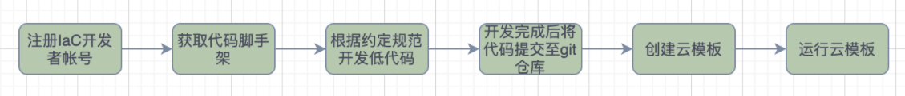

#### 开发流程



#### 平台地址
下面使用 http://cloudiac.example.com/ 进行演示说明。

#### 登录用户名、密码
使用注册时填写的邮箱和密码直接登录，如果是组织管理员为您创建的用户，创建完成后登录信息将会邮件发送到您的邮箱

#### 获取演示模板
cloudiac 部署后自带一个演示模板，可以基于该模板进行开发。

```shell
# git clone http://cloudiac.example.com/repos/cloud-iac/cloudiac-example.git
```

#### 目录结构规范
```text
.
├── README.md       # 项目说明文档(必选)
├── main.tf         # terraform 主配置文件(必选)
├── versions.tf     # 指定依赖的 providers 及其版本(必选)
├── variables.tf    # input 变量定义(必选)
├── outputs.tf      # output 变量定义(必选) 
├── ansible         # ansible 相关资源目录(可选)
│   ├── playbook.yml    # ansible playbook
│   └── index.html      # playbook 中使用的文件
├── qa-env.tfvars    # QA 环境 tfvars(可选)
├── prod-env.tfvars  # 生产环境 tfvars(可选)
```

- "必选" 只表示文件必须存在，但内容可以为空
- 更详细的说明见 cloudiac-example 项目的 README

#### 云模板开发
创建新模板可以在 cloudiac-example 项目基础上修改，或者创建一个全新项目，但**必须符合以上目录结构规范**。

下面以基于 cloudiac-example 开发为例演示模板开发过程：
1. 在您使用的 VCS 中创建远程仓库    
    目前支持的 vcs 类型有: gitlab, github, gitee, gitea

2. 基于 cloudiac-example 创建项目
```shell
# mv cloudiac-example tf-webapp
# cd tf-webapp 
# rm -rf .git && git init .
# git remote add origin https://github.com/my/tf-webapp
```

3. 进行云模板开发，完成后并将代码推送到远程仓库
```shell
# git add .
# git commit -m "Initial commit"
# git push origin master
```

#### 运行云模板
##### 添加 VCS
IaC 平台通过 VCS 来访问云模板库，在执行云模板前需要先将使用的 VCS 添加到平台。

1. 登录 IaC 平台，选择所在组织，在『设置』页面中选择『VCS』；
2. 点击『添加 VCS』，在弹出的页面中填写必要信息，然后保存。

##### 创建云模板
1. 进入『云模板』板页面并选择『创建云模板』；
2. 进入『选择仓库』步骤，左上角选择上一步添加的 vcs，然后在下方列表中选择 tf-webapp；
3. 输入云模板名称、描述、分支、是否保存状态、运行时默认的 CT-Runner；
4. 保存提交，即可在『云模板』列表中看到新创建的模板。

注：一个仓库可能覆盖多种场景，创建的云模板对应的场景建议在描述中加以说明，方便用户使用

##### 云模板参数配置及运行
1. 云模板创建成功后，可以进入『变量』配置页面进行更详细的配置； 
2. 添加需要的变量，并选择 tfvars 和 playbook 文件；
3. 点击模板页面右上角的『新建作业』即可运行模板。

注：『Terraform 变量部分』会自动解析出 **variables.tf** 文件中的变量名称、默认值、描述，在添加时可进行选择

