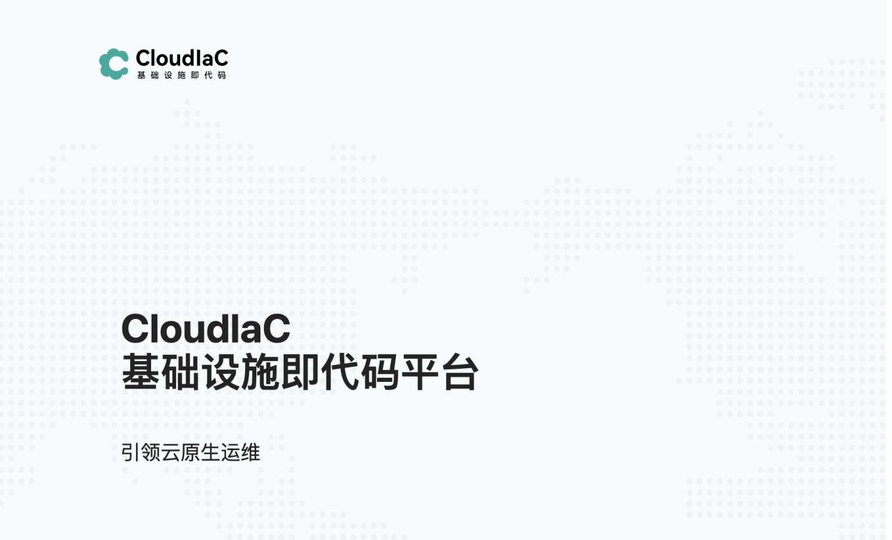
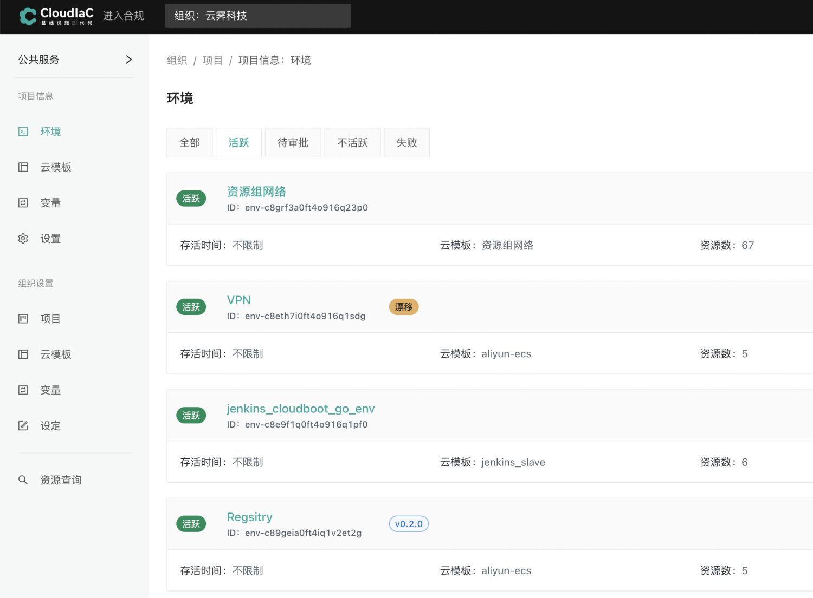
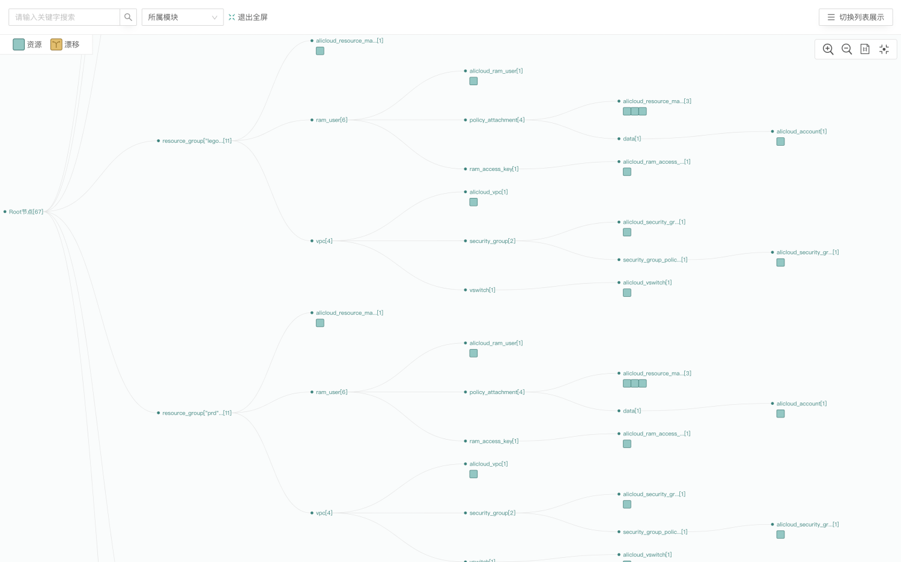
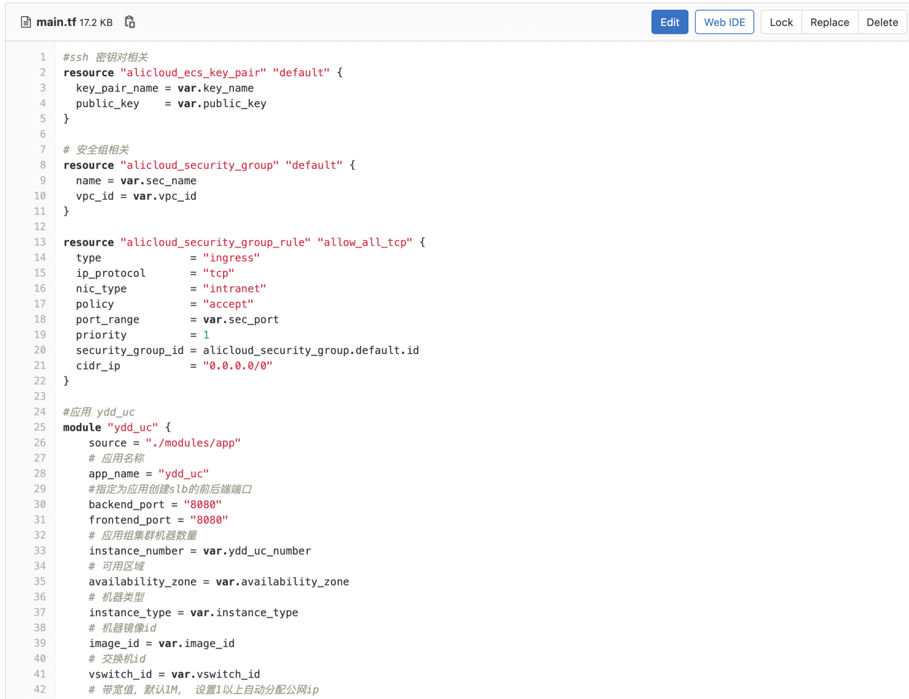
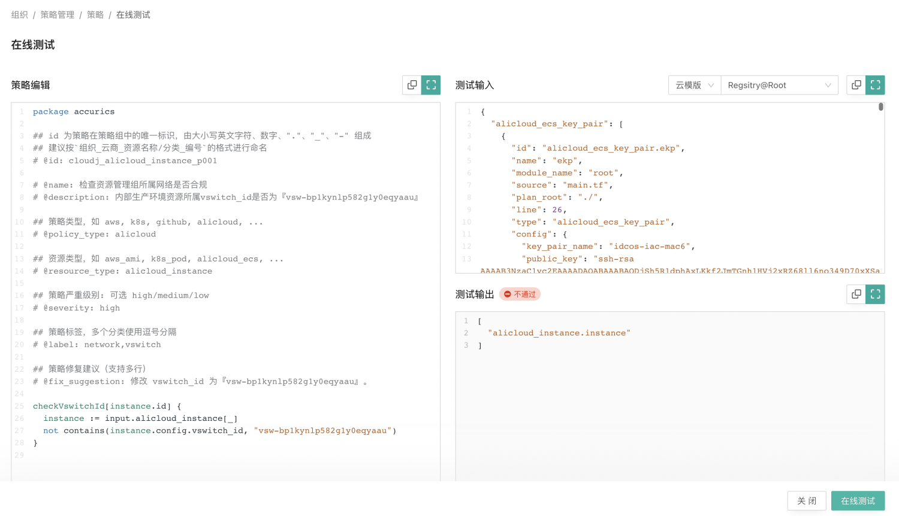
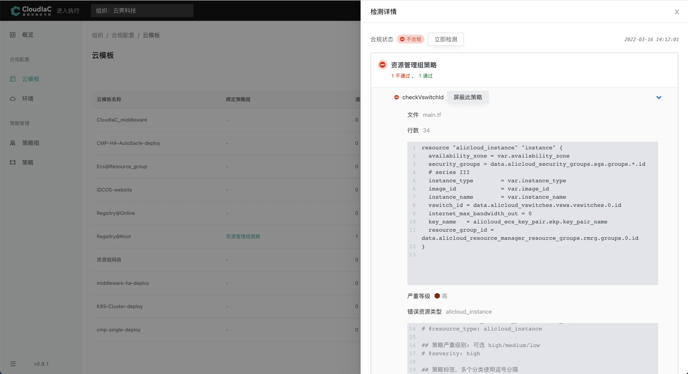
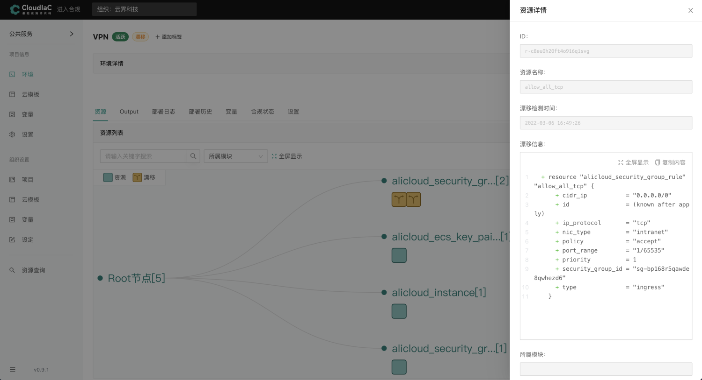
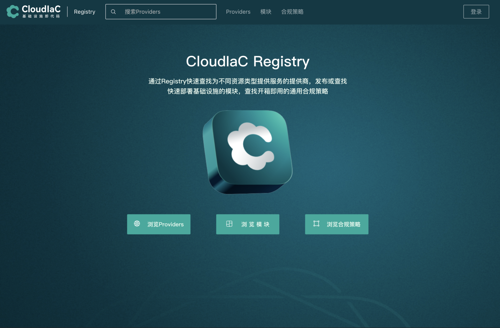
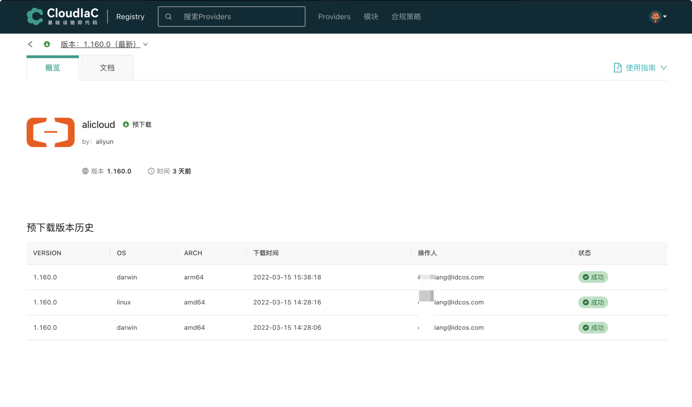

## 产品概述

CloudIaC是一个开源基础设施即代码管理平台，它以『环境即服务』的方式来管理基础设施以及应用所属的环境，提供远程运行环境来执行“部署”并简化Terraform、Ansible 等 IaC 框架的云部署治理。

  

  

  

将基础设施和应用以代码交付

通过Terraform和Ansible的结合，使用声明式的配置文件将基础设施和应用编写为代码，并使用VCS来管理并控制配置文件的版本。

  

在基础设施创建之前进行合规检测

CloudIaC融合OPA（Open Policy Agent）引擎，以策略即代码的方式对即将创建的基础设施进行合规检查，在安全风险和错误配置发生之前尽量降低它们。

  

  

对环境进行漂移检测

开启环境的『漂移检测』，及时发现漂移的发生，接收漂移发生的通知并通过资源拓扑直观呈现漂移数据。

  

公有云环境费用统计及预估

公有云环境月度费用统计，掌握云端环境资源整体费用及占比情况，同时可在环境执行计划预览时给出月度费用预估，供管理员审批时参考。
（设计稿）

CloudIaC Registry

CloudIaC提供私有Registry，管理Provider/Module/Policy，同时可作为Provider代理，解决企业私有化部署或网络不可达情况下Terraform使用困难的问题。

  

  
