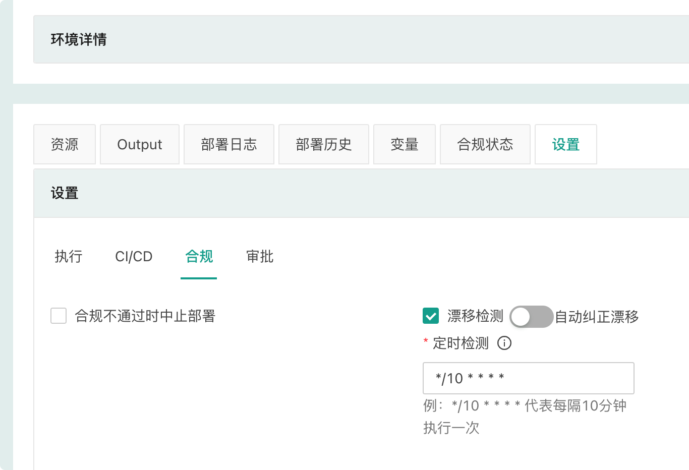
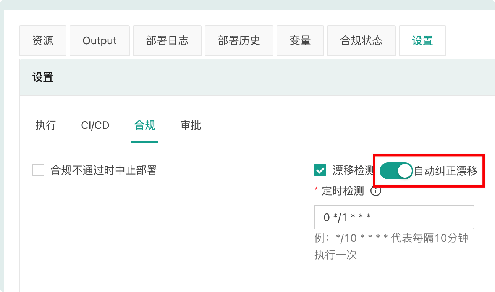

## 存活时间

*存活时间*是 CloudIaC 从设置完存活时间的时间点到自动销毁环境下资源的时间长度(若是初始创建的环境则会在资源第一次创建成功后开始计算自动销毁时间)；

可以在创建或重新部署环境时设置存活时间，预选值有：*不限*、*12小时*、*1天*、 *3天*、*1周*、*半个月*、*1个月*和*指定时间*，选择『指定时间』时可以直接设置一个具体截止时间；

一个*不限*存活时间的环境将永远不会被自动销毁，通常生产环境等静态环境会设置为不限时间，开发、测试环境则可以根据需要设置合适的存活时间；

## 漂移检测

漂移检测的“漂移”概念来自“配置漂移”，配置漂移是指在运维过程中，服务器上的配置文件会被人为修改，导致服务器之间的配置或者与配置管理中的配置不一致，这种不一致会导致非预期的问题，增加维护成本。

在 CloudIaC 中，“漂移” 指的是环境的资源与云模板中定义的资源不一致。为了及时发现这种不一致并进行修正，CloudIaC 提供了漂移检测功能。

### 漂移检测实现

CloudIaC 通过执行 terraform plan 来检测资源漂移，如果执行 plan 会发生资源变动则表示资源出现了漂移。因此 CloudIaC 目前只支持检测 terraform 资源的不一致，对于使用 ansible 部署的服务则无法检测。

CloudIaC 执行漂移检测时会使用环境最后一次部署时的 commit id，以保证是基于最后一次部署后的资源进行漂移检测。

### 配置漂移检测

您可以通过环境配置来开启漂移检测:

{.img-fluid}

开启漂移检测后 CloudIaC 会根据 crontab 表达式定义的周期，定时的执行 plan 任务来进行漂移检测，并对有漂移的资源进行标识。

查看环境资源详情时可以看到资源是否有漂移:

{.img-fluid}

**注意:** CloudIaC 的自动漂移检测只针对活跃环境进行。

### 自动纠正漂移

对于开启了漂移检测的环境，还可以选择开启“自动纠正漂移”:

{.img-fluid}

如果开启“自动纠正漂移”，则 CloudIaC 会自动进行漂移纠正，相当于定时执行环境部署任务。

**注意:** 当自动纠正任务执行失败时，环境会变为“失败”状态，此时漂移检测（包括自动纠正漂移任务）将不会再触发，需要人工介入进行修复。

### 漂移检测通知

您可以在 组织-> 设置 -> 通知中开启配置漂移通知，开启后会在检测到环境有漂移时发送通知。

如果您配置了部署成功和部署失败通知，则执行自动纠正漂移成功或失败也会发送相应通知。

## 自动重试

在执行环境部署操作时，您可能希望CloudIaC在出现错误时自动重试；

针对每个云模板您可以启用自动重试，并可以配置重试间隔和次数；

CloudIaC 的每一次部署会有多个步骤，重试只会重新执行当前步骤，快成功执行的步骤不会重复执行。

## 自动 plan/apply

CloudIaC 支持在您的云模板仓库发生变更时自动执行 plan 或者 apply，此功能包含了两个选项目：

**推送到分支时重新部署**
  

开启该功能后，当环境对应云模板仓库有新的 commit push 且目标分支为当前环境使用的分支时会自动触发环境的重新部署。

开启该功能需要同步开启环境的自动审批：

  

**PR/MR时执行PLAN**
  

开启该功能后，当环境对应云模板仓库有新的 PR/MR 且目标分支为环境当前使用的分支时会自动执行 Plan 任务，并将任务执行结果以评论的方式添加到 PR/MR，以便进行 review。

!!!Info
    一般情况下，一个环境是不允许有多个任务同时执行的，通过页面发起部署任务时如果环境已有任务在执行则会报错：
      

    但如果是通过 “推送到分支时重新部署” 或 “PR/MR时执行PLAN” 功能创建任务，则同一个环境下的任务会按照创建时间**排队执行**。

