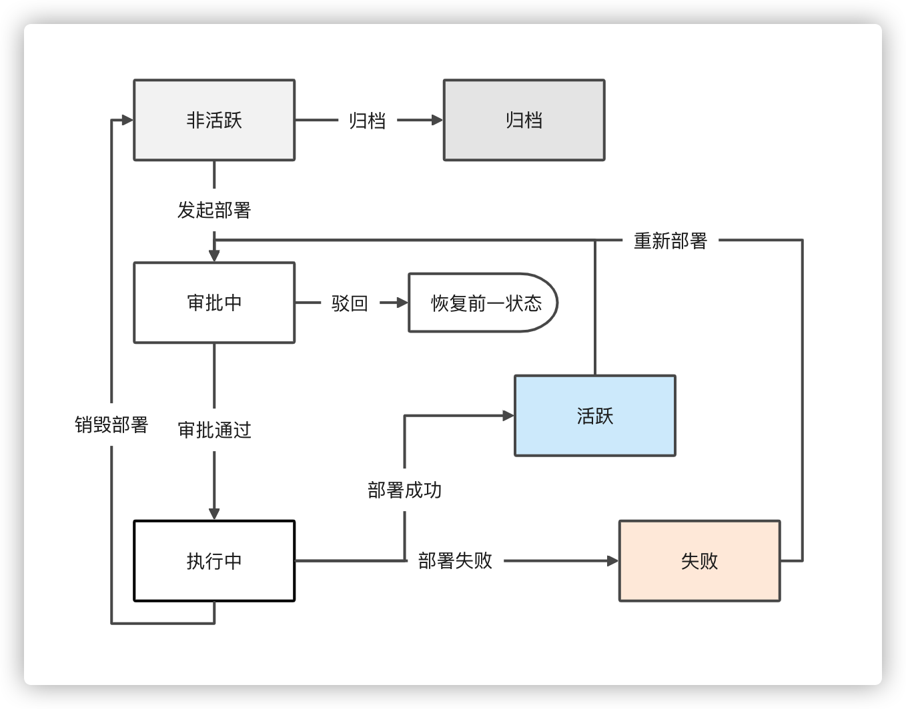
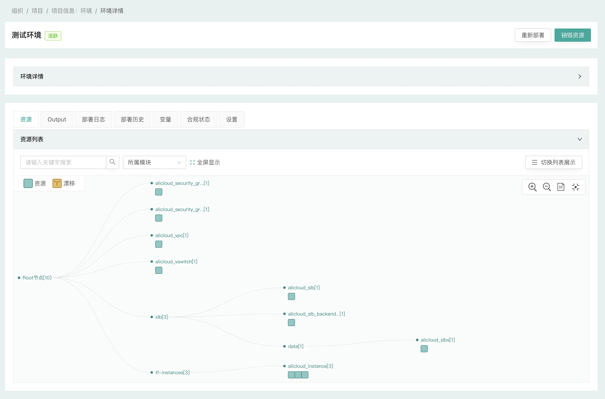
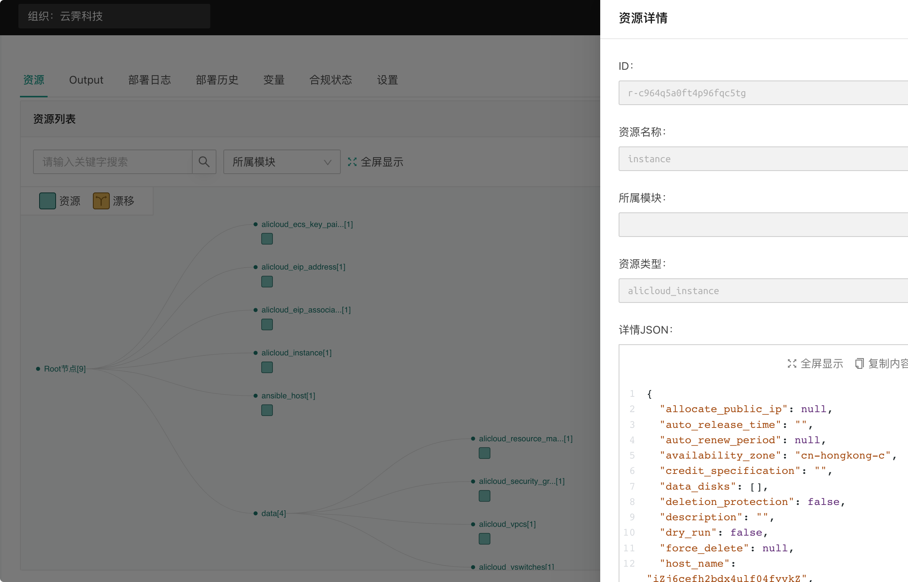

# 环境管理

## 什么是环境

环境是由 CloudIaC 管理的部署实例，是CloudIaC管理资源的核心；

用户通过在组织下创建云模板，并运行云模板进行部署来创建新的环境，同时在项目下对环境进行管理；

用户可以创建、重新部署环境，并可对环境下的资源进行销毁；

CloudIaC 通过 Terraform 的状态文件来维护整个环境的状态，用户可以通过修改变量或修改资源描述配置文件来进行重新部署，新的部署会在上一次的状态下进行，通过这种机制，用户可以更加方便的实现对环境资源的扩缩容等操作；同时对于环境下资源的销毁，基于状态也可以快速的实现一键完全的清理。

## 查看环境详细信息

您可以通过『项目』-『环境』菜单查看您的环境，该页面将列出该项目下所有的环境列表；

对于每个环境，您可以看到它是由哪个云模板创建、创建人、当前状态、环境下创建的资源数量以及剩余的生存时间；

点击环境，展开查看环境详情，在环境详情页面中，您可以执行『重新部署』、『销毁资源』等操作，还可以查看最新部署的日志、Terraform输出、部署中使用的变量以及部署历史记录。

## 环境状态

环境的状态包括以下几种：

- *活跃*：成功部署并启动运行
- *不活跃*：资源已销毁
- *执行中*：正在部署或者销毁过程中
- *失败*：在部署过程中发生错误
- *待审批*：operator发起部署作业后等待Manager或Approver审批

{.img-fluid}

## 环境资源

当您的环境处于*活跃*状态时，您只需单击环境即可查看其中包含的资源。

{.img-fluid}
{.img-fluid}

## 创建环境

请参考[部署环境](../quick-start/deploy-env.md)

## 销毁资源

有两种方式对环境下的资源进行销毁；

一种是设置了『存活时间』的环境，在达到时间限制时会自动销毁；

另一种是手动销毁，在『环境详情』页面点击右上角的『销毁资源』来进行销毁操作；

当*活跃*环境下的资源被销毁成功，环境状态将设置为*不活跃*，如果销毁资源失败，环境状态将设置为*失败*。

## 重新部署环境

对于已经创建出来的环境，您可以重新部署，在环境详情页面，点击右上角的『重新部署』来进行；

如果您的环境当前正在运行部署或销毁任务则无法发起新的部署，您需要等待前一次部署结束才能发起新的任务；

当您重新部署『不活跃』环境时，在部署成功后，环境状态将自动转为『活跃』；

重新部署时，除非手动重新设置存活时间，否则默认使用环境原有的存活时间。

## 审批流程

对于在环境中执行的每个创建、销毁或重新部署作业， CloudIaC 首先创建一个*Terraform Plan*，然后会进入『待审批』状态，需要由项目的Manager或Approver角色用户来进行批准才能继续执行部署；

Manager或Approver角色的用户可以在创建环境时选中『自动通过审批』来在后续的部署操作中自动批准而无需等待；

如果用户没有设置自动批准，CloudIaC 将在*Terraform plan*创建后进入等待，直到Manager或Approver主动批准执行计划。

## 环境设置

点击“环境详情” - “设置”进入环境设置页面，在页面中可以配置环境的属性、执行规则、合规策略等。

!!! Note
    注意，环境的部分配置只允许在执行部署时进行修改，如环境变量、terraform 变量、tfvars 文件、playbook 文件等。

## 归档环境

为了帮助用户管理环境，ClouidIaC 可以让用户归档不再使用（不活跃状态）的环境，归档后的环境将不再可用。

通过环境配置页面可以进行环境的归档操作。