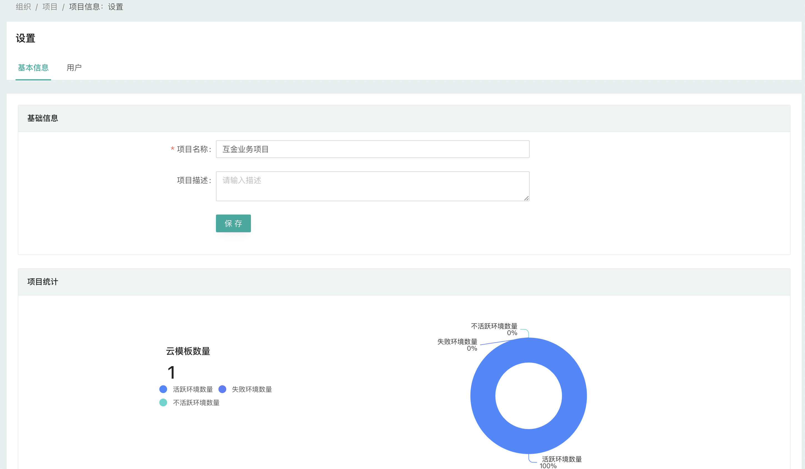

## 组织管理
### 什么是组织

组织是CloudIaC中最高层级的逻辑实体；

多个组织间数据隔离。

每个组织下设有项目、VCS、云模板、变量、环境、Token、通知、资源帐号等管理；

通常情况下一个用户属于一个组织，同时支持一个用户加入多个组织，并在每个组织下可以具有不同的角色和权限。

### 选择组织

用户首次登录CloudIaC后将进入组织选择页面，选择对应组织后进入该组织视图，如需要创建新组织，请参考[创建组织及项目](../quick-start/create-org-project.md)；

顶部导航栏的组织下拉列表中可以列出当前用户所属的组织，通过选择下拉列表中的组织名称可以切换活动组织。

### 加入组织

用户可以通过以下方式加入组织：

1. 通过组织管理员邀请，组织管理员可以设置用户是管理员还是普通用户
2. 平台管理在创建组织时邀请，被邀请的用户将成为新组织的管理员

被邀请加入组织的用户将收到邮件通知。

### 创建组织

只有平台管理员可以创建组织和编辑组织信息；

要创建新组织，请选择右上角下拉菜单的『系统设置』-『组织管理』，然后单击*创建组织*。

### 组织设置

**组织**是 CloudIaC 中配置的最高范围，所有其他实体都继承组织的设置;

只有组织管理员才能更改该组织的设置或邀请新用户加入该组织。

----------
## 项目管理
### 什么是项目

项目在 CloudIaC 中用于提供对环境的细粒度访问控制，每个环境都存在于一个项目下，并且用户可以在每个项目的基础上获得访问权限；

项目可以更好的支持在单个组织内管理多个云帐户的场景；

建议使用项目将开发、测试环境与生产环境分开，每个项目都有自己的访问权限和策略。

{.img-fluid}

### 活跃项目

用户选择当前组织后进入组织视图，顶部下拉菜单将显示当前用户有权限的项目列表；

点击项目名称展开该项目菜单列表，选择项目下相应功能即可进入该项目视图。

### 创建新项目

要创建新项目，在左侧菜单『组织设置』-『项目』中进入项目管理，点击『新建项目』；

输入项目名称、描述即可创建新项目；

您可以在项目创建完成后『项目信息』-『用户』管理中给指定用户授予相应角色权限。

### 归档项目

项目下的环境均无资源时可以选择将项目归档，归档后的项目将不在项目下拉菜单中显示。

----------
## 用户角色管理

### 用户

一个用户可以属于一个或多个组织；

平台管理员、组织管理员和项目管理员都可以邀请用户加入相应的层级，并为用户指定相应的角色。

### 平台角色

CloudIaC提供以下几种角色：

- Root：平台管理员
	- 拥有平台所有权限，包括创建和修改组织
	- 该账号只在系统初始化时创建，无法将用户授权为该角色
- Admin：组织管理员
	- 在组织内拥有所有权限
- Member：普通用户
	- 根据管理员授予的项目角色拥有相应的权限
- Member：合规管理员
	- 拥有合规中心的管理权限

{.img-fluid}

### 项目角色

CloudIaC在项目中提供四种角色：

- Manager：管理者
	- 对整个项目具有所有权限，包括修改项目设置、添加/修改变量、创建/修改环境、审批部署作业、添加/管理项目中用户等
- Approver：审批者
	- 可以在项目中添加/修改变量、创建/修改环境、审批部署作业
- Operator：执行者
	- 可以基于云模板进行环境部署、发起重新部署、销毁资源等操作，但除了plan计划之外的作业都需要Manager或Owner审批，通过后才能继续执行；
- Guest：查看者
	- 只能查看项目中的环境以及环境的状态等信息，无权创建、破坏或更改环境

{.img-fluid}
