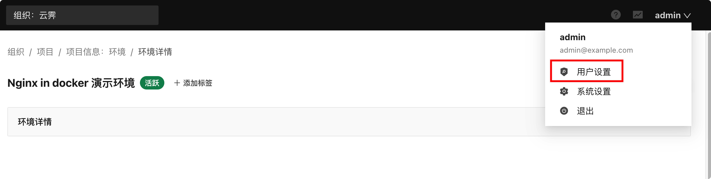
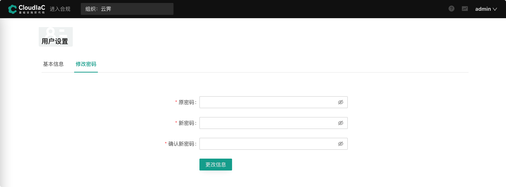
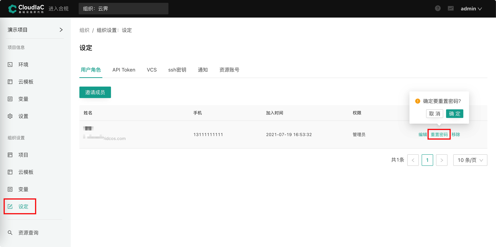
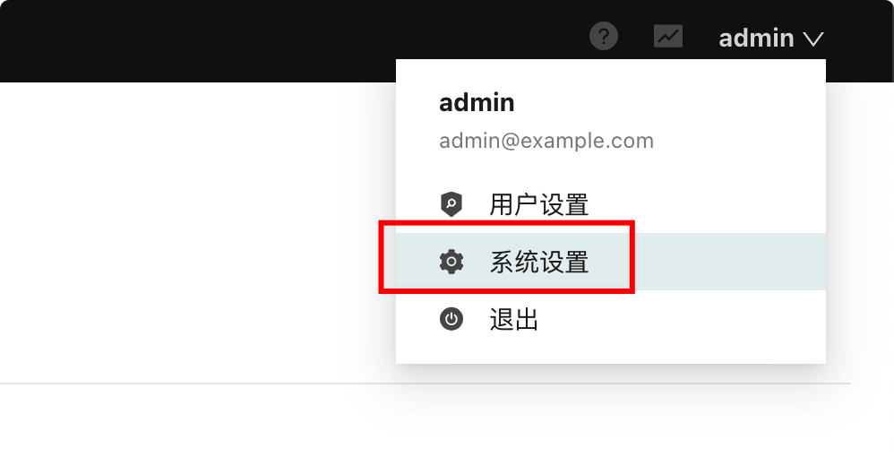

## 密钥管理

### SSH 密钥

cloudiac 提供 ssh 密钥管理功能，可以在组织中添加 ssh 密钥，以支持 playbook 的执行。

cloudiac 不生成密钥，只支持添加己生成的 ssh 私钥。私钥可以是您手动生成，或者在云商平台创建后导出。

因为使用 ssh 连接执行 playbook，所以若环境配置了 playbook 时，则必须为其配置 ssh 密钥。

为了能进行 ssh 认证，需要在创建计算资源时绑定对应的公钥；同时，为计算资源绑定公钥通常需要先在云商创建 ssh 密钥对，以上过程需要您通过云模板进行配置或者手动创建。

可以查看 cloudiac-example 示例模板代码了解如何在模板中配置 ssh 密钥对。

{.img-fluid}

------
## 通知管理
通知功能允许您设置关注的事件，并在事件发生时通过配置的渠道发送通知消息。

**目前支持的事件类型有:**

- 发起部署
- 等待审批
- 部署失败
- 部署成功
- 配置漂移

**目前支持的通知渠道有:**

- 邮件
- 企业微信
- 钉钉
- Slack

{.img-fluid}

## 修改密码
### 修改个人密码
点击页面右上角的用户图标，在下拉菜单中选择 “用户设置” 进入用户设置页面:
{.img-fluid} 

点击“修改密码”，输入原密码和新密码后提交，即可修改个人密码：
{.img-fluid}  

### 管理员重置用户密码

组织管理员可以通过 “组织” -> “设置” -> “用户角色” 页面可以进行用户的密码重置：
{.img-fluid}  

重置后的密码将通过邮件发送给用户。

## 系统设置
平台管理员可以点击页面右上角的用户图标，在下拉菜单中选择 “系统设置” 进入系统设置页面:
{.img-fluid}  

在系统设置中可以进行组织的管理，系统参数配置，及 Registry 配置。

