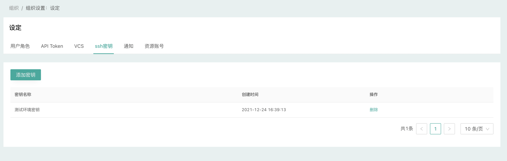
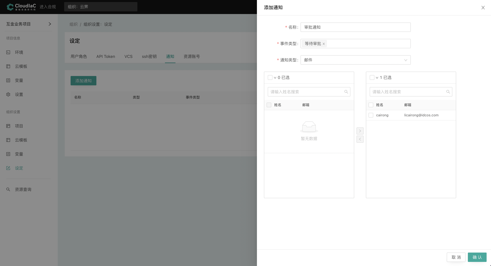

## 密钥管理

### SSH 密钥

cloudiac 提供 ssh 密钥管理功能，可以在组织中添加 ssh 密钥，以支持 playbook 的执行。

cloudiac 不生成密钥，只支持添加己生成的 ssh 私钥。私钥可以是您手动生成，或者在云商平台创建后导出。

因为使用 ssh 连接执行 playbook，所以若环境配置了 playbook 时，则必须为其配置 ssh 密钥。

为了能进行 ssh 认证，需要在创建计算资源时绑定对应的公钥；同时，为计算资源绑定公钥通常需要先在云商创建 ssh 密钥对，以上过程需要您通过云模板进行配置或者手动创建。

可以查看 cloudiac-example 示例模板代码了解如何在模板中配置 ssh 密钥对。

{.img-fluid}

------
## 通知管理
通知功能允许您设置关注的事件，并在事件发生时通过配置的渠道发送通知消息。

**目前支持的事件类型有:**

- 发起部署
- 等待审批
- 部署失败
- 部署成功
- 配置漂移

**目前支持的通知渠道有:**

- 邮件
- 企业微信
- 钉钉
- Slack

{.img-fluid}
