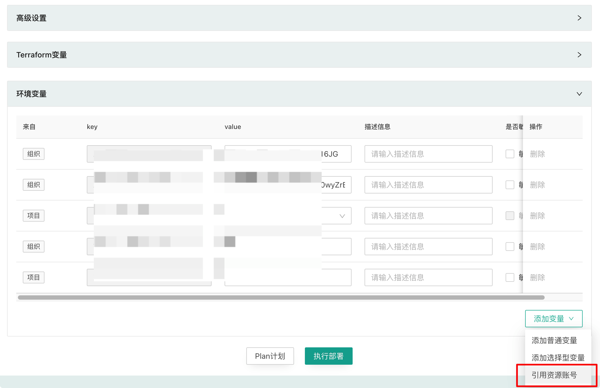
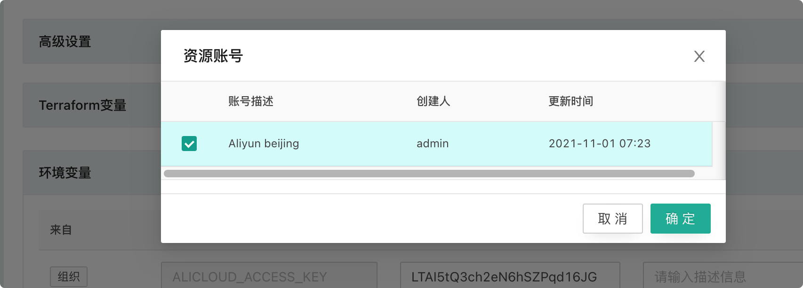

------
## 变量管理

### 变量继承

CloudIaC中的变量可以组织、云模板、项目、环境四个层级中进行设置；

在组织中定义的变量会应用在该组织中所有部署的环境上；

在项目中定义的变量会应用在该项目中所有部署的环境上；

在云模板中定义的变量会应用在所有基于该云模板部署的环境上；

在整个继承链条上同名的变量低层级的值覆盖高层级的值；

{.img-fluid}

当进行环境部署操作时，各层级继承的变量会全部列出，您可以对变量进行重新赋值。

### Terraform变量

Terraform变量是Terraform执行时使用的变量，通常在资源描述配置文件里定义好变量的引用；

对于Terraform变量，在环境部署作业发起时将自动将变量加上TF_VARS_前缀，以便让Terraform可以辩识。

### 环境变量

环境变量通常是用来定义云平台相关的变量，例如云凭证ak/sk、区域、可用区等；

您可以根据不同项目来配置不同云凭证变量，以便管理不同平帐号下的环境资源。

### 其他变量

其他变量只在『云模板』中进行定义，包含tfvars文件变量和playbook文件变量；

tfvars文件通常是定义不同资源的变量放在不同的tfvars文件中，这样在执行terraform时通过引用不同的tfvars文件来创建不同的资源；

playbook文件是在调用ansible进行应用部署时定义的描述配置文件，您同样可以预先定义好不同的playbook文件对应不同的应用部署，在部署环境时根据传入的playbook文件变量来决定部署何种应用。

### 敏感信息

在定义变量时，有些变量的值是敏感信息，不方便让所有用户看到，例如云凭证ak/sk或密码等信息，您可以在定义此类变量的值时勾选『敏感信息』复选框；

对于敏感信息变量的值，CloudIaC 将在存储时会对此类值进行加密，并且不会返回给前端展示，以提高其安全性。

### 选择型变量

选择型变量是指在创建变量时定义了变量的可选值列表，下一级继承该变量时直接选择列表中的值，而不是手动输入。

选择型变量不可设置为敏感类型。

### 平台导出的环境变量

除了用户配置的环境变量，CloudIaC 还会在执行任务时自动导出当前任务和环境相关的环境变量，这些变量可以在自定义步骤中使用。平台导出的环境变量列表如下：

| 变量名称               | 描述                                         |
| ---------------------- | -------------------------------------------- |
| CLOUDIAC_ORG_ID        | 当前任务的组织 ID                            |
| CLOUDIAC_PROJECT_ID    | 当前任务的项目 ID                            |
| CLOUDIAC_TEMPLATE_ID   | 当前任务的模板 ID                            |
| CLOUDIAC_ENV_ID        | 当前任务的环境 ID                            |
| CLOUDIAC_ENV_NAME      | 当前任务的环境名称                           |
| CLOUDIAC_ENV_STATUS    | 当前环境状态(启动任务时)                     |
| CLOUDIAC_ENV_RESOURCES | 当前环境中的资源数据(启动任务时)             |
| CLOUDIAC_COMMIT        | 当前任务的云模板代码 commit hash             |
| CLOUDIAC_BRANCH        | 当前任务的云模板代码的分支                   |
| CLOUDIAC_TASK_ID       | 当前任务的 id                                |
| CLOUDIAC_TF_VERSION    | 当前任务使用的 terraform 版本号(eg. 0.14.11) |

------
## 资源帐号管理

访问云商 Api 接口都需要通过 AK/SK 来进行谁，在 CloudIaC 中这些认证信息通过环境变量的方式传入。资源账号就是提供 AK/SK 的统一管理功能。

### 添加资源账号

资源账号通过 “组织设置” / “资源账号”页面添加，添加资源账号时填写云商 Provider 认证需要使用的环境变量(包括 AK、SK、Region)。

{.img-fluid}

### 资源账号的引用和继承

资源账号在组织级别添加后可以添加到组织、云模式、项目、环境的环境变量。

{.img-fluid}

{.img-fluid}

实例引用的资源账号不可修改、只能从实例中删除资源账号。
{.img-fluid}

!!!Info
    引用资源账号时如果实例现有资源账号中存在与当前资源账号同名的变量，则会禁止添加。

资源账号在添加到实例后与普通变量一样，也会自动继承给下级实例。

两个资源账号中存在任意一个同名变量，则我们认为这两个资源账号冲突。当添加的资源账号发生冲突时，如果两个资源账号属于同一级则禁止添加，如果两个资源不属于同一级，子级账号覆盖父级账号。

### 资源账号与环境变量的优先级
资源账号的优先组低于普通变量，当同一实例中资源账号变量和普通变量名称冲突时，普通变量优先生效。
这样允许您在引用资源账号后，再通过添加普通变量来覆盖资源账号中指定变量的值。
