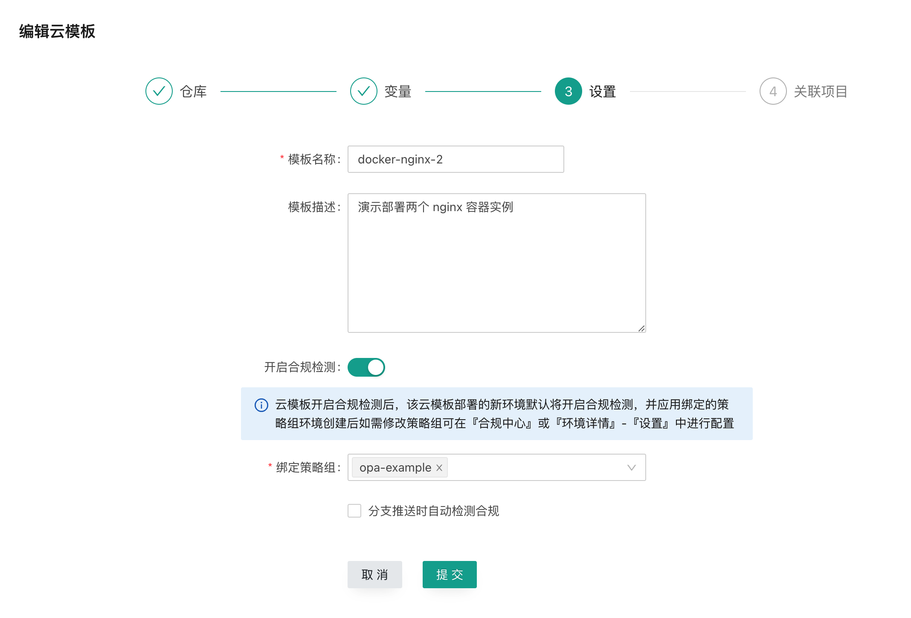
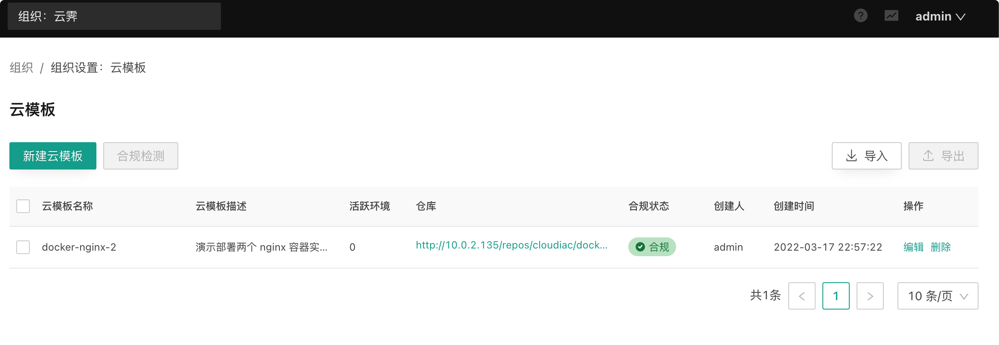

# 云模板管理

## 什么是云模板

云模板是CloudIaC中定义的一种可以部署的环境类型；

云模板由名称、描述、一组描述部署的有效配置文件以及一组变量组成；

通过云模板中的『部署新环境』可以立即开始创建新环境。

## 创建云模板

请参考[创建云模板](../quick-start/create-template.md)

## 管理云模板

云模板在组织范围内添加、编辑或删除；

云模板由组织管理员创建、编辑和删除，普通用户只能基于已创建好的云模板进行部署或plan计划，但可以在发起部署操作时对变量进行修改；

在云模板创建后，您可以在编辑操作中修改云模板的配置，例如引用不同VCS仓库的代码仓库、分支或标签；

如果您需要删除云模板，在检查该云模板没有活跃状态的环境存在的前提下，可以删除该云模板。

## 云模板合规
在云模板的编辑页面的“设置”步骤中可以对云模板开启合规检测并绑定合规策略组：
{.img-fluid}

开启合规检测后并保存就会触发合规检测，在云模板列表中即可查看其合规状态：
{.img-fluid}

!!!Info
    云模板开启合规后基于该云模板新创建环境都会默认开启合规检测，并绑定云模板中设置的合规策略组，您可以选择将其关闭或者重新绑定合规策略组。

!!!note
    也可以通过合规中心来开启云模板的合规检测，具体请参考：[安全合规](../../manual/compliance/)

## Terraform 版本选择

在创建云模板时可以选择需要使用的 terraform 版本，我们预置了主流的 terraform 版本供选择，或者让系统自动匹配。

选择自动匹配时，我们读取您模板代码库的 versions.tf 文件中的版本约束，若预置列表中有满足约束的版本则使用匹配的版本，若无则会在 terraform 的所有版本中选择最小满足版本约束的版本。

如果使用的非内置 terraform 版本，则会在执行部署时实时下载，我们会对已下载过的 terraform 版本进行缓存，避免重复下载。

## 基于云模板创建环境

云模板创建并关联到项目后即可在项目中通过云模板创建环境，在云模板中也可以对环境的一些配置进行预设置，在创建环境时会自动使用云模板中的默认值，从而简化环境的创建过程。

以下配置项会在新创建环境时自动使用：

- 分支/标签
- 合规检测状态及绑定的策略组
- tfvars 文件
- playbook 文件
- ssh 密钥

另外，云模板中创建的变量也会自动继承给环境。

!!!Info
    对云模板的修改只会影响基于该云模板新部署的环境，已部署的环境不受影响，即使是对环境重新执行部署。但变量是一个例外，修改云模板的变量会在下一次环境部署时生效；
