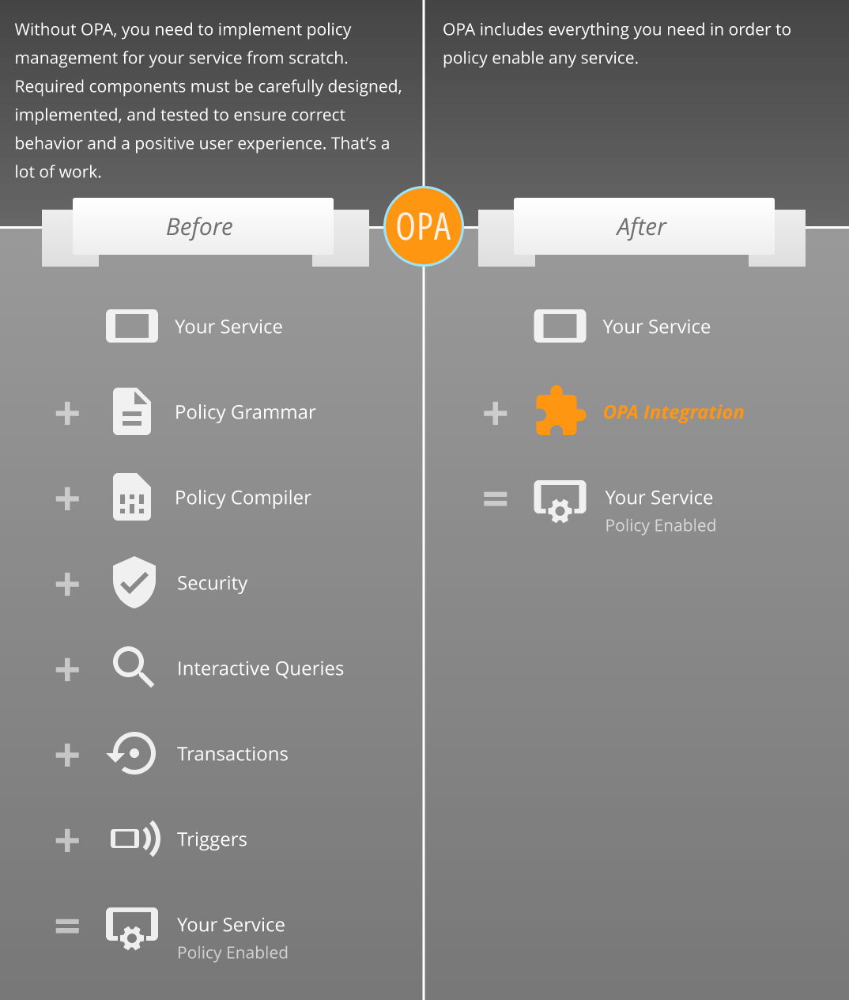

# 安全合规

## 什么是合规

一旦配置了云基础设施，就必须对其进行持续监控，以防止引入风险的变化，并评估配置更改是否违反合规性和最佳安全实践。

在 CloudIaC 0.6 版本中，我们引入 OPA 来进行安全和合规检测。

合规作为 CloudIaC 的扩展功能，相对独立，不配置合规不影响平台的使用。合规功能目前只对**平台管理员**开放。平台管理员可以通过点击页面顶栏左侧的“进入合规”链接跳转到合规管理页面。

### OPA

[OPA（Open Policy Agent）](https://www.openpolicyagent.org/) 是一个开源的通用策略引擎，它可以统一整个应用的策略执行。

OPA 提供了一种高级声明性语言 Rego，可以让您将策略指定为代码和简单的 API，从而将策略的执行从应用中解耦。

{.img-fluid}

### Rego

OPA 策略以称为 Rego 的高级声明性语言表达，Rego 专门用于在复杂的分层数据结构上表达策略。

https://www.openpolicyagent.org/docs/latest/policy-language/

## 合规策略及策略组

合规策略即一条 Rego 语言描述的检测规则。创建策略时可以实时进行测试，调整输入和规则定义。

多个策略绑定到策略组，以组合实现复杂的合规规则。

*注意，当前版本中一个策略只能关联到一个策略组。*

## 应用合规策略

为了应用合规策略，我们需要将策略组绑定到环境或者云模板，并开启环境或云模板的合规检测功能。

开启合规检测的云模板会在每次编辑后自动执行合规检测。

开启合规检测的环境在部署时会自动执行合规策略的检测步骤，在部署日志中可查看合规策略执行的输出。若同时在环境设置中开启了 “合规不通过中止部署” 则在合规检测不通过时将中断部署，这样就能确保部署的环境符合合规要求。

除了自动触发检测步骤，我们也可以在合规管理页面或云模板和环境的管理页面手动发起合规检测。

## 屏蔽合规策略

为了实现灵活的策略组合配置，我们提供了策略屏蔽功能。

当希望某条策略在某个环境(或云模板)中不生效时，可以将策略在指定的环境(或云模板)上屏蔽，这样即使环境(或云模板)绑定了包含该策略的策略组，在执行检测时也不会应用该策略。

如果希望某条策略临时的在所有环境(或云模板)中不生效，则可以直接将该策略设置为屏蔽状态。

## 策略组的继承

每个环境都有一个关联的云模板，如果为云模板绑定了策略组则基于该云模板创建的环境会自动开启合规检测，并绑定云模板中使用的策略组，默认绑定的策略组可以手动移除。这样就允许您为云模板绑定一些基础合规规则，而环境的合规要求就可以再单独为环境配置。
