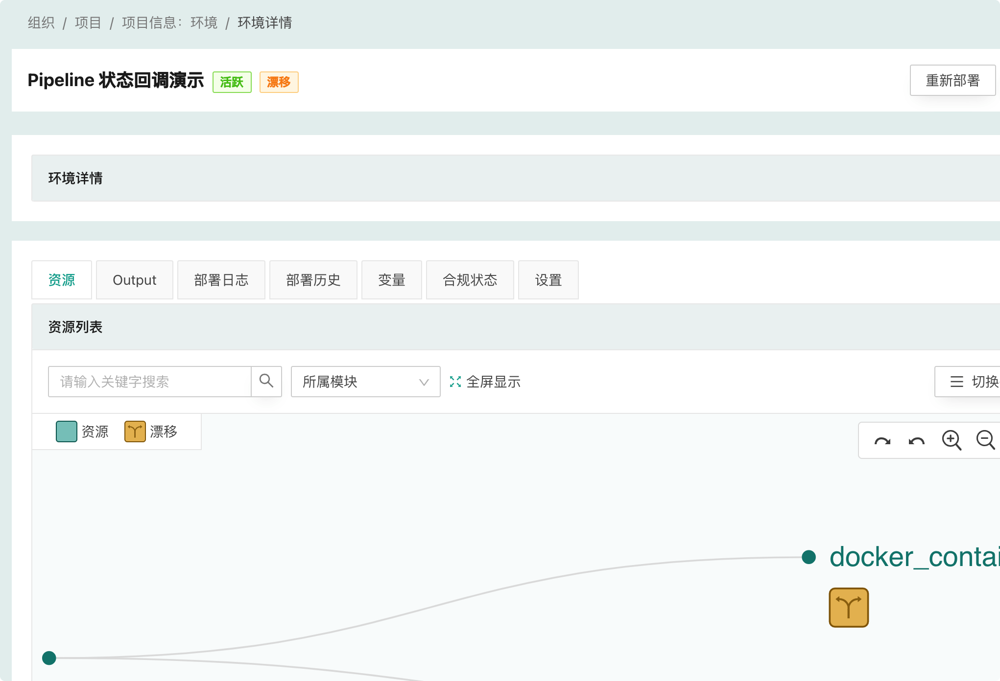

# 漂移检测

漂移检测的“漂移”概念来自“配置漂移”，配置漂移是指在运维过程中，服务器上的配置文件会被人为修改，导致服务器之间的配置或者与配置管理中的配置不一致，这种不一致会导致非预期的问题，增加维护成本。

在 CloudIaC 中，“漂移” 指的是环境的资源与云模板中定义的资源不一致。为了及时发现这种不一致并进行修正，CloudIaC 提供了漂移检测功能。

## 漂移检测实现

CloudIaC 通过执行 terraform plan 来检测资源漂移，如果执行 plan 会发生资源变动则表示资源出现了漂移。因此 CloudIaC 目前只支持检测 terraform 资源的不一致，对于使用 ansible 部署的服务则无法检测。

CloudIaC 执行漂移检测时会使用环境最后一次部署时的 commit id，以保证是基于最后一次部署后的资源进行漂移检测。

## 配置漂移检测

您可以通过环境配置来开启漂移检测:

开启漂移检测后 CloudIaC 会根据 crontab 表达式定义的周期，定时的执行 plan 任务来进行漂移检测，并对有漂移的资源进行标识。

查看环境资源详情时可以看到资源是否有漂移:

**注意:** CloudIaC 的自动漂移检测只针对活跃环境进行。

## 自动纠正漂移

对于开启了漂移检测的环境，还可以选择开启“自动纠正漂移”:

如果开启“自动纠正漂移”，则 CloudIaC 会自动进行漂移纠正，相当于定时执行环境部署任务。

**注意:** 当自动纠正任务执行失败时，环境会变为“失败”状态，此时漂移检测（包括自动纠正漂移任务）将不会再触发，需要人工介入进行修复。

## 漂移检测通知

您可以在 组织-> 设置 -> 通知中开启配置漂移通知，开启后会在检测到环境有漂移时发送通知。

如果您配置了部署成功和部署失败通知，则执行自动纠正漂移成功或失败也会发送相应通知。
