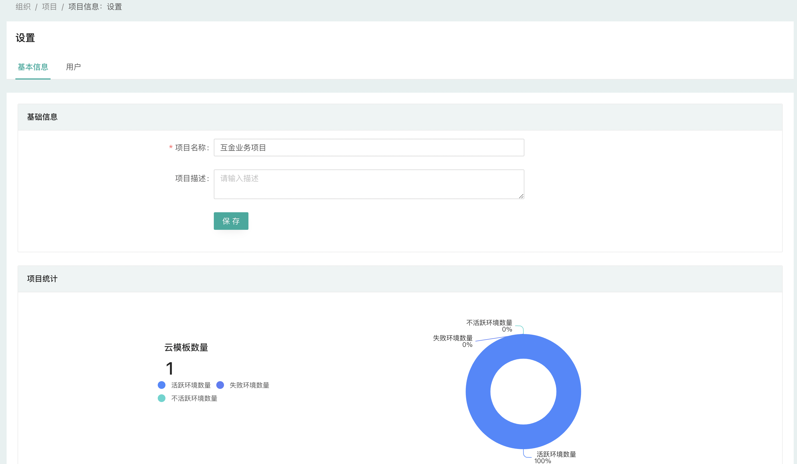

# 项目管理

## 什么是项目

项目在 CloudIaC 中用于提供对环境的细粒度访问控制，每个环境都存在于一个项目下，并且用户可以在每个项目的基础上获得访问权限；

项目可以更好的支持在单个组织内管理多个云帐户的场景；

建议使用项目将开发、测试环境与生产环境分开，每个项目都有自己的访问权限和策略。

{.img-fluid}

## 活跃项目

用户选择当前组织后进入组织视图，顶部下拉菜单将显示当前用户有权限的项目列表；

点击项目名称展开该项目菜单列表，选择项目下相应功能即可进入该项目视图。

## 创建新项目

要创建新项目，在左侧菜单『组织设置』-『项目』中进入项目管理，点击『新建项目』；

输入项目名称、描述即可创建新项目；

您可以在项目创建完成后『项目信息』-『用户』管理中给指定用户授予相应角色权限。

## 归档项目

项目下的环境均无资源时可以选择将项目归档，归档后的项目将不在项目下拉菜单中显示。
