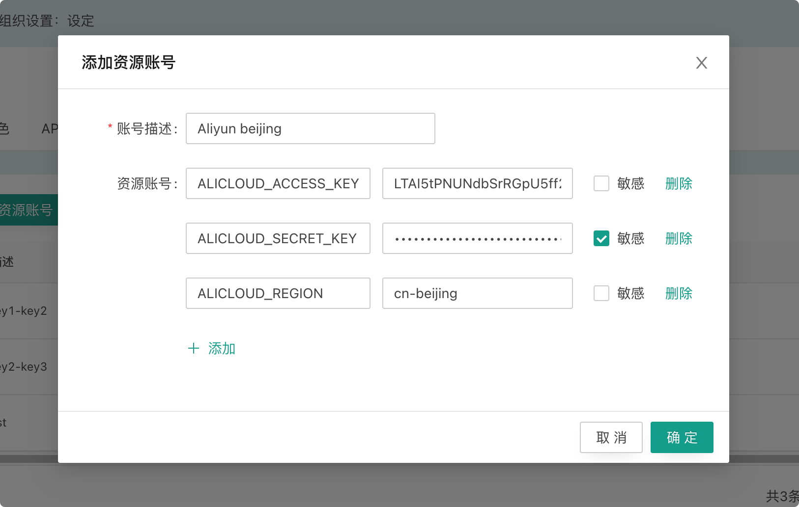
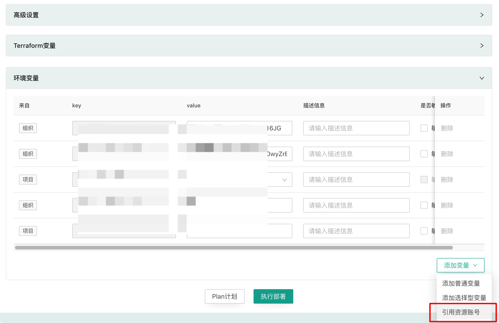
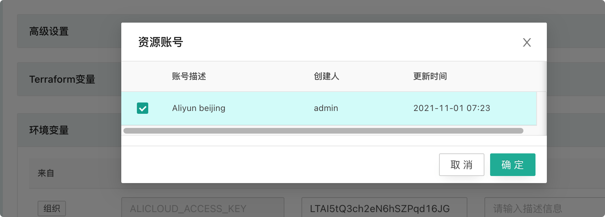
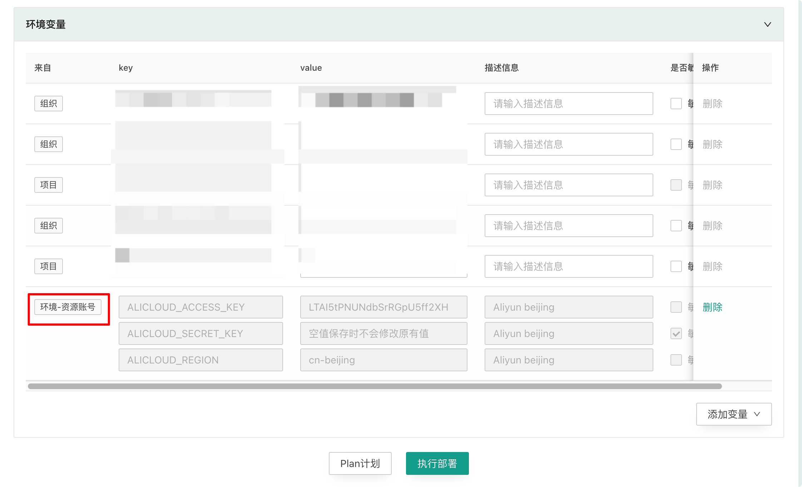

# 资源帐号

访问云商 Api 接口都需要通过 AK/SK 来进行谁，在 CloudIaC 中这些认证信息通过环境变量的方式传入。资源账号就是提供 AK/SK 的统一管理功能。

## 添加资源账号

资源账号通过 “组织设置” / “资源账号”页面添加，添加资源账号时填写云商 Provider 认证需要使用的环境变量(包括 AK、SK、Region)。

{.img-fluid}

## 引用资源账号

资源账号在组织级别添加后可以添加到组织、云模式、项目、环境的环境变量。

{.img-fluid}

{.img-fluid}

实例引用的资源账号不可修改、只能从实例中删除资源账号。
{.img-fluid}

引用资源账号时如果实例中己引用的资源账号中存在与当前资源账号同名的变量，则会禁止添加。

## 资源账号的继承和覆盖

资源账号在添加到实例后与普通变量一样，也会自动继承给下级实例。

两个资源账号中存在任意一个同名变量，则我们认为这两个资源账号冲突。当添加的资源账号发生冲突时，如果两个资源账号属于同一级则禁止添加，如果两个资源不属于同一级，子级账号覆盖父级账号。

## 资源账号与普通变量的关系

资源账号的优先组低于普通变量，当同一实例中资源账号变量和普通变量名称冲突时，普通变量优先生效。

这样允许您在引用资源账号后，再通过添加普通变量来覆盖资源账号中指定变量的值。
