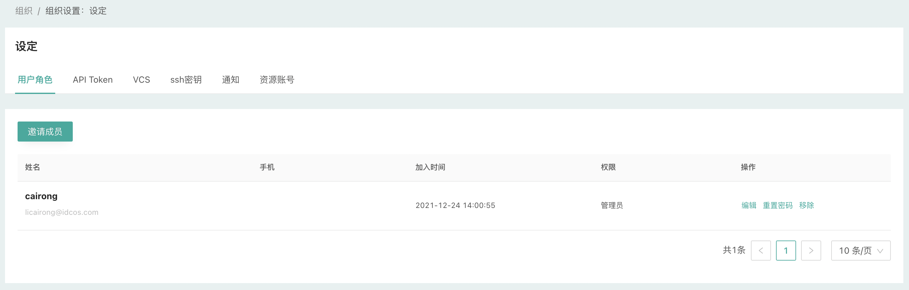
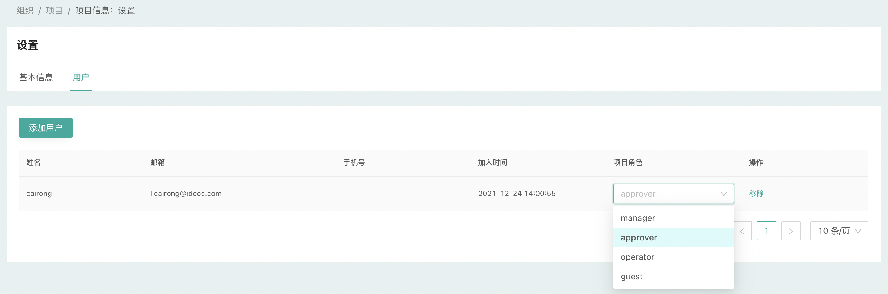

# 用户角色

## 用户

一个用户可以属于一个或多个组织；

平台管理员、组织管理员和项目管理员都可以邀请用户加入相应的层级，并为用户指定相应的角色。

## 平台角色

CloudIaC提供以下几种角色：

- Root：平台管理员
  - 拥有平台所有权限，包括创建和修改组织
- Admin：组织管理员
  - 在组织内拥有所有权限
- Member：普通用户
  - 根据管理员授予的项目角色拥有相应的权限

## 项目角色

CloudIaC在项目中提供四种角色：

- Manager：管理者
  - 对整个项目具有所有权限，包括修改项目设置、添加/修改变量、创建/修改环境、审批部署作业、添加/管理项目中用户等
- Approver：审批者
  - 可以在项目中添加/修改变量、创建/修改环境、审批部署作业
- Operator：执行者
  - 可以基于云模板进行环境部署、发起重新部署、销毁资源等操作，但除了plan计划之外的作业都需要Manager或Owner审批，通过后才能继续执行；
- Guest：查看者
  - 只能查看项目中的环境以及环境的状态等信息，无权创建、破坏或更改环境

