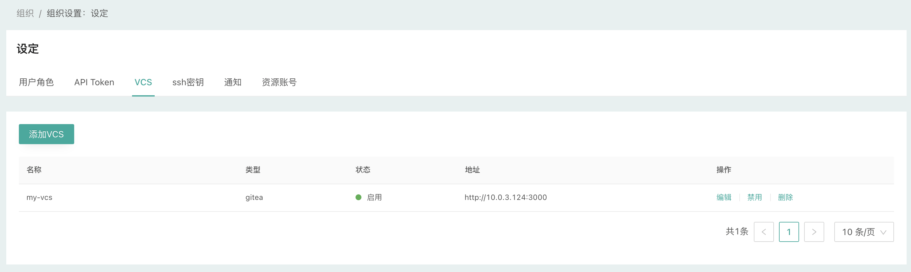

# VCS管理

## 什么是VCS

VCS是版本控制系统的简称（Version Control System）

CloudIaC中所有基础设施描述以及合规策略的代码都通过VCS（版本控制系统）进行管理，所以在创建组织后第一件事就是添加VCS集成，以便在创建云模板或合规策略时进行引用。

CloudIaC通过添加VCS的方式来集成版本控制系统，从而获取代码仓库中的配置文件。

{.img-fluid}

## 支持的VCS类型

CloudIaC目前支持以下四种VCS集成：

- GitHub
- GitLab
- Gitee
- Gitea

## 添加VCS集成

请参考[集成VCS](../quick-start/integrated-vcs.md)
