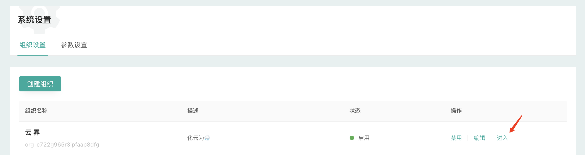

!!!Info
    组织是CloudIaC中最高层级的逻辑实体，多个组织间数据隔离。

#### 创建组织
管理员首次登录CloudIaC，首先需要创建一个组织：

{.img-fluid}

在『系统设置』-『组织设置』中点击『创建组织』

{.img-fluid}

创建组织的点击右侧的『进入』进入组织界面

{.img-fluid}

#### 创建项目

在组织界面中，您可以按不同维度来创建项目，比如按照应用维度、组织维度来进行项目规划都可以

{.img-fluid}

项目创建后，切换到该项目
{.img-fluid}  

**项目创建后我们需要创建云模板并关联到项目，下一步[创建环境](create-template.md)。**