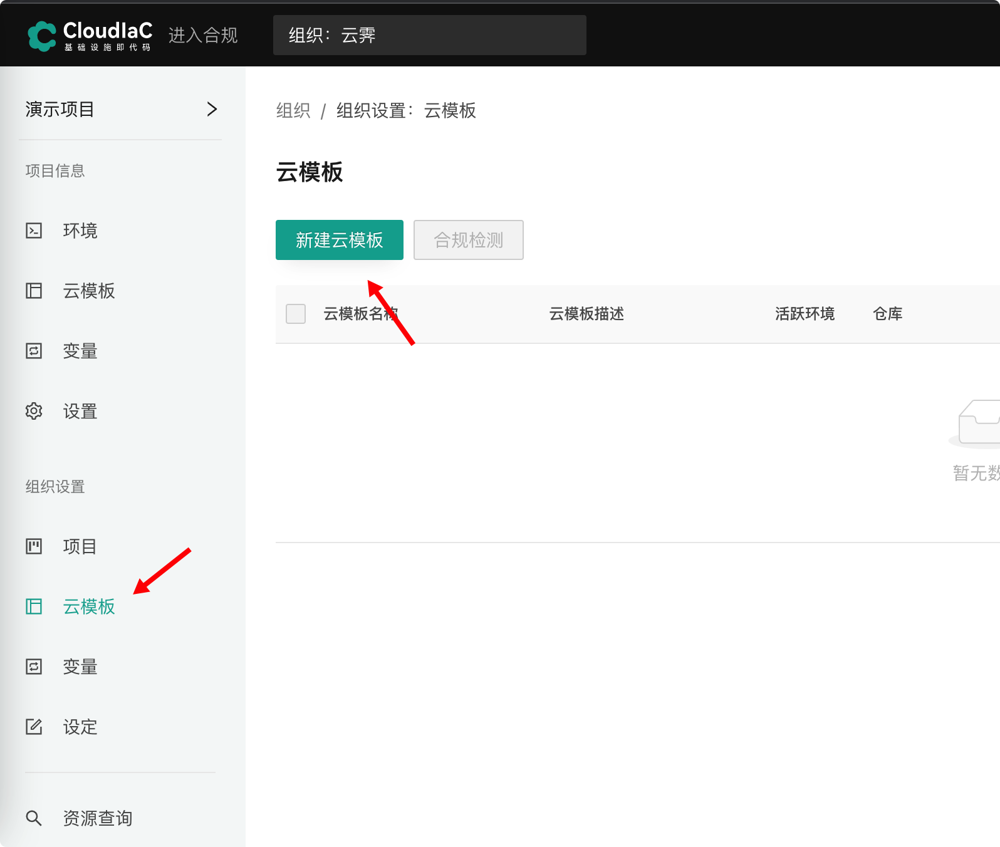
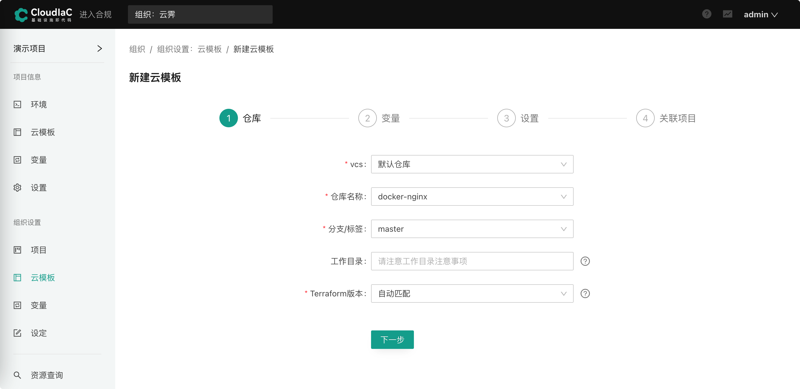
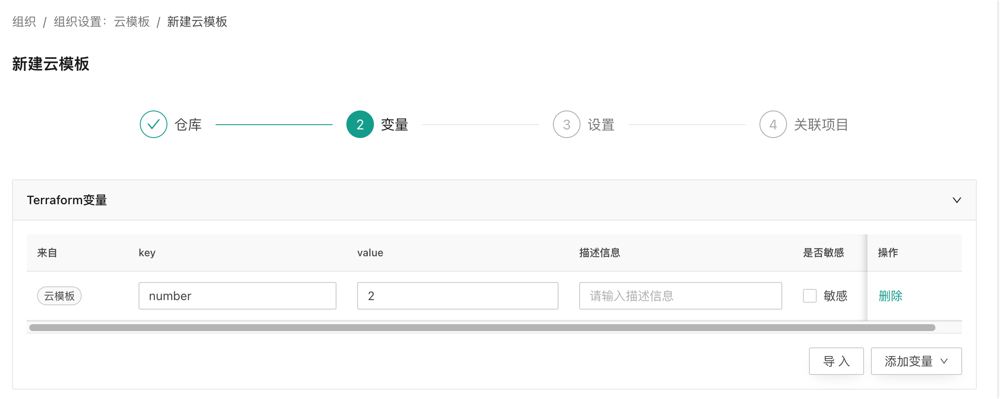
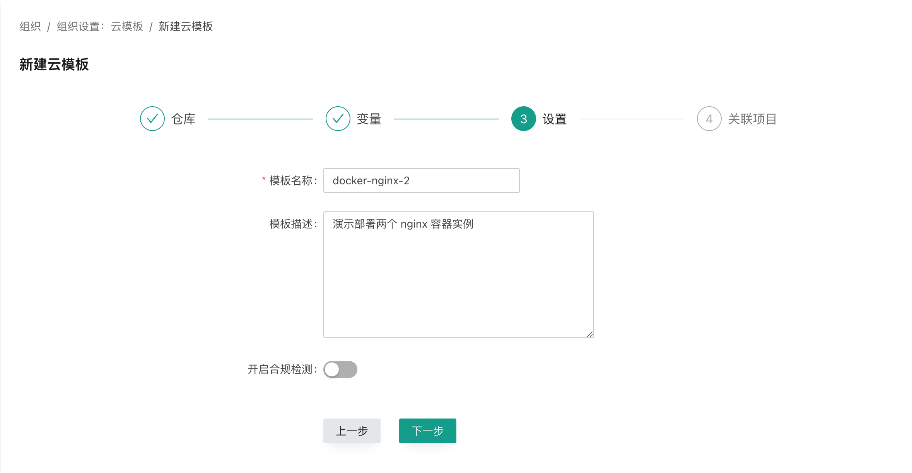
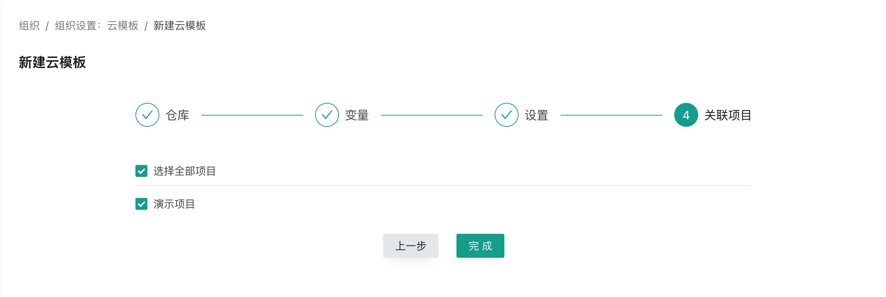
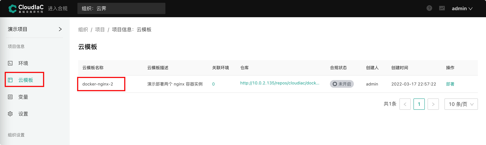

#### 新建云模板

进入『组织设置』-『云模板』页面并选择『新建云模板』

{.img-fluid}

#### 选择VCS仓库

进入『仓库』步骤，按下图所示选择配置，配置完成后点击“下一步”。
{.img-fluid}

!!!info
    这里我们选择默认 vcs 中的 docker-nginx 仓库，默认 VCS 是在 CloudIaC 部署完成后自带的 vcs，其中有我们内置的常用云模板样板间。docker-nginx 为一个使用 docker 部署 nginx 服务的演示云模板，该云模板是直接创建 docker 容器资源，所以并不需要配置云商资源账号。

#### 设置变量
在『变量设置』步骤中，根据使用的云模板不同需要传入不同的环境变量或者 terraform 变量。我们上一步中选择的 docker-nginx 云模板有一个 key 为 "number" 的 terraform 变量，这个变量可以控制我们启动的容器实例数量，我们先其设置为 2，表示启动两个 nginx 容器，其他配置不需要修改，然后点击“下一步”

{.img-fluid}
#### 基础设置
在『设置』步骤输入云模板名称、描述，点击下一步。
{.img-fluid}

!!!info
    “开启合规检测”设置部分我们这里先跳过，详细介绍可以参考：[安全合规](../manual/compliance.md)。

#### 关联项目

最后选择将该云模板关联到“演示项目”，然后点击“完成”。
{.img-fluid}

创建完成后，即可在项目下看到该云模板:
{.img-fluid}

**云模板创建完成后即可进行下一步，[部署环境](./deploy-env.md)。**
