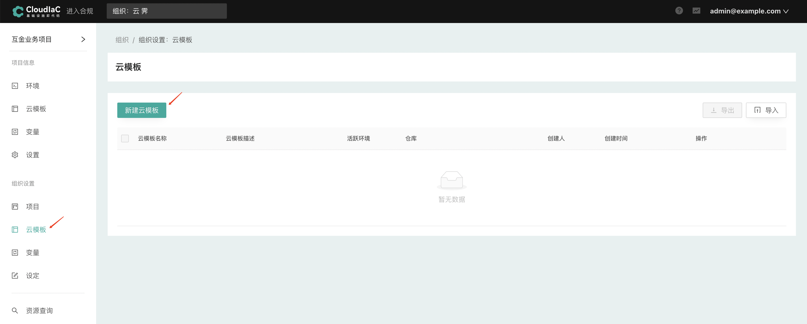

#### 新建云模板

1. 进入『组织设置』-『云模板』页面并选择『新建云模板』

#### 基础设置

在『基础设置』步骤输入云模板名称、描述，点击下一步

#### 选择VCS仓库

进入『选择仓库』步骤，选择版本控制系统（VCS），然后在仓库列表中选择目标仓库，选择分支或Tag

#### 设置变量

在『变量设置』步骤中，设置部署时需要传递的变量，您可以通过Terraform变量中的『导入』按钮来选择导入variables.tf中定义的变量，也可以选择代码仓库中预定义的tfvars文件，如果您需要使用ansible来部署应用，可以在其他变量中选择相应的playbook文件

在『环境变量』中设置您需要创建环境的云平台凭证（AK/SK），如果您在组织的『变量』设置中添加了相应变量或在『组织设定』-『资源帐号』中添加了相应的凭证，则此处会自动继承

#### 关联项目

最后选择将该云模板关联到哪些项目，关联后的项目将可以看到该云模板，并基于该云模板部署环境

创建完成后，在关联的项目下即可看到该云模板

