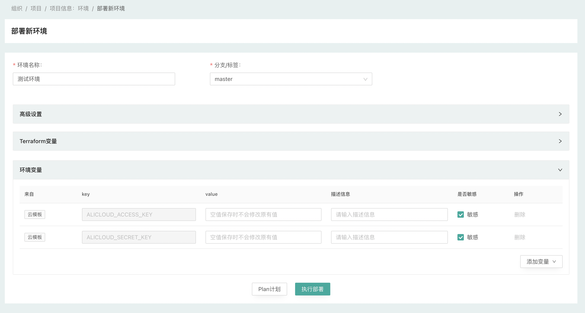

## 部署环境

添加云模板并关联到项目后，您就可以基于云模板部署环境了，一个环境包含哪些资源都是在云模板中定义的，如果云模板中定义了相应变量，那您在部署时可以传入相应变量来控制环境中资源数量及属性。

#### 发起部署

进入『项目信息』-『云模板』页面，可以看到与该项目关联的云模板，选择相应的云模板，点击『部署』即可发起环境部署操作

{.img-fluid}

#### 设置变量

在环境部署页面中，可以看到云模板定义的变量以及组织、项目下定义的变量，您可以对继承的变量进行重新赋值，也可以添加新的变量

{.img-fluid}

#### 高级设置

输入环境名称，点击页面下方的『执行部署』即可发起环境的部署，如需对环境做更多设置可在『高级设置』中进行

{.img-fluid}

#### 部署日志

通过『部署日志』，您可以实时查看部署时的详细日志，了解部署实时进展，对于有资源变更的任务，将会在『计划预览』后进入待审批状态，管理员审批通过后即可继续部署

{.img-fluid}

{.img-fluid}

#### 环境详情

部署完成后，进入环境的详情页面即可查看该环境的基础信息、资源、输出等详细信息

{.img-fluid}

至此，恭喜您，您的第一个环境部署成功。

