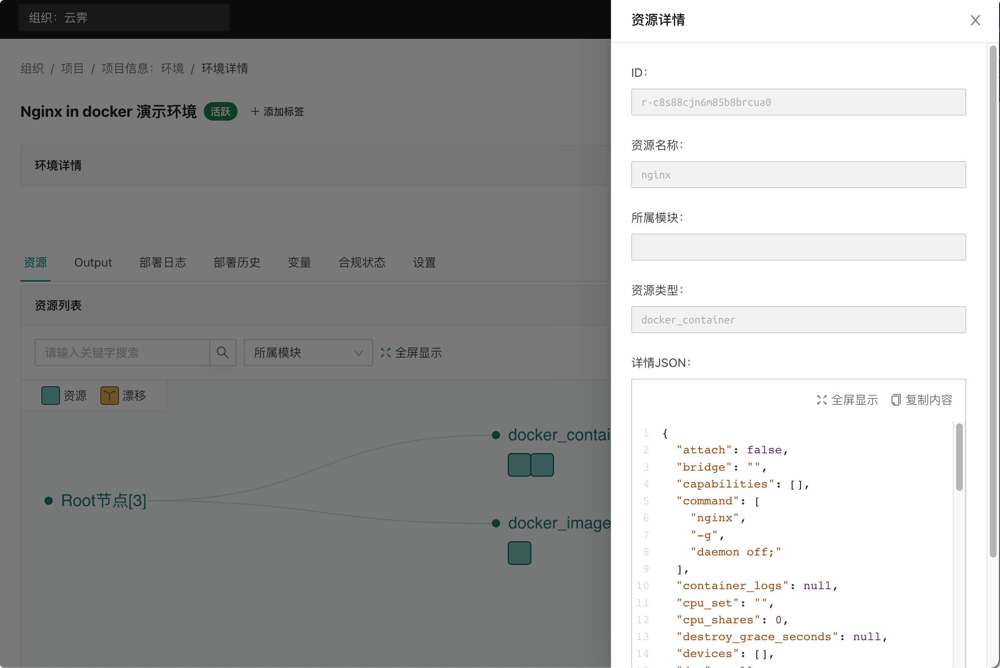
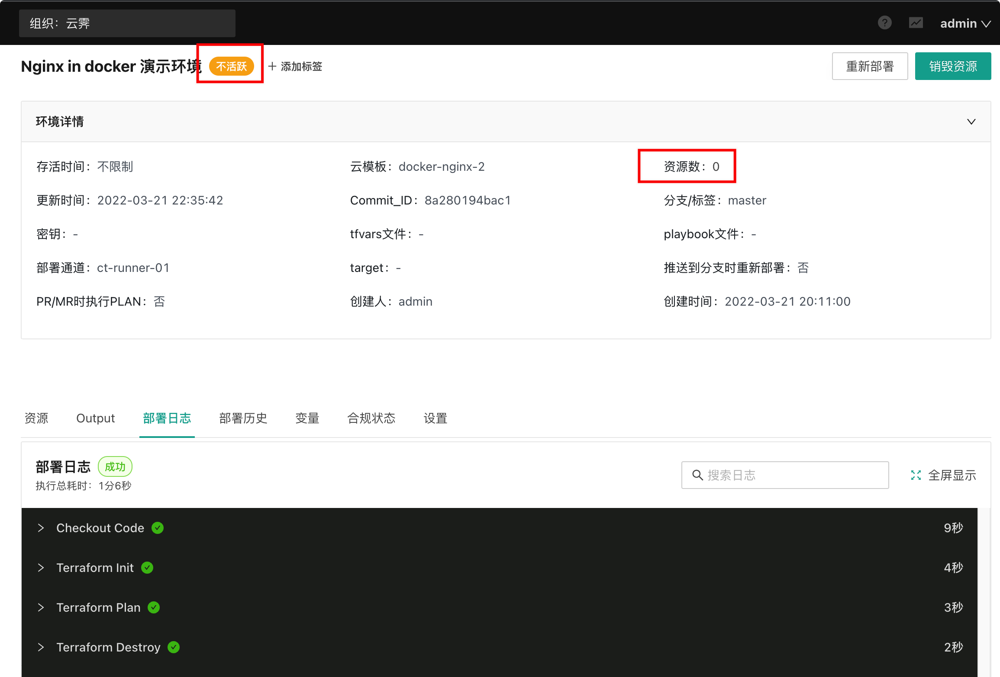

## 部署环境
添加云模板并关联到项目后，我们就可以基于云模板部署环境了。

#### 发起部署

进入『项目信息』-『云模板』页面，可以看到与该项目关联的云模板，选择相应的云模板，点击『部署』即可发起环境部署操作

{.img-fluid}
#### 环境设置
在环境部署页面中，可能定义环境名称，选择使用的云模板仓库分支/标签（默认的分支/标签直接使用云模板中配置的值。

展开 Terraform 变量会发现自动继承了在云模板中设置的变量值 number：
{.img-fluid}

展开高级设置可以对环境进行更多的配置:
{.img-fluid}

环境部署时的详细配置项可以查看 [环境管理](../../manual/env/)，我们这里不做额外配置，直接点击“执行部署”按钮发起环境部署。

#### 部署日志

发起部署后会跳转到环境详情页面，并展示部署日志，通过部署日志我们可以实时查看当前在执行的步骤和运行状态：
{.img-fluid}

执行完 terraform plan 步骤后部署任务会进入待审批状态，此时可以查看 plan 步骤的日志确定会创建或变更的资源。日志里可以看到我们这次部署会创建 3 个新资源，我们点击“通过”审批，继续执行部署：
{.img-fluid}

#### 环境详情

部署完成后，进入环境的详情页面即可查看该环境的基础信息、资源等详细信息:
{.img-fluid}

{.img-fluid}

#### 验证部署结果

通过资源详情页面和 Output 信息可以知道，我们部署的环境中启动的两个 nginx 服务导出的端口分别为 49216 和 49215：
{.img-fluid}

通过浏览器访问 clouaic ct-runner 服务所在机器的这两个端口进行测试，返回了默认的 nginx 欢迎页，表示我们的环境部署成功。
{.img-fluid}

{.img-fluid}

#### 销毁环境

一般情况下我们成功部署环境后就可以在其上部署服务或者进行下一步的管理工作，但对于演示项目我们显然是不需要进一步使用的，而且也不希望其继续占用资源，所以我们需要将环境销毁，从而释放掉创建的资源(在我们的演示环境中对应的就是两个容器实例)。下面我们就进行环境销毁操作。

进入环境详情，点击右上角的“销毁资源”按钮，在弹出的窗口中输入环境名称，然后点击“确认”，发起环境销毁任务：
{.img-fluid}

任务发起后会自动跳转到部署日志页面，等待 terraform plan 步骤完成后，进行销毁任务的审批:
{.img-fluid}

通过审批后销毁任务继续执行，最后环境销毁成功，所有资源被释放:
{.img-fluid}

!!!info
    恭喜您，完成了第一个环境部署和销毁。接下来可以查看我们的 [使用教程](../../tutorial/) 获取更多的部署场景演示，也可查看 [产品手册](../../manual/org-project-role/) 获取更全面的功能介绍。
