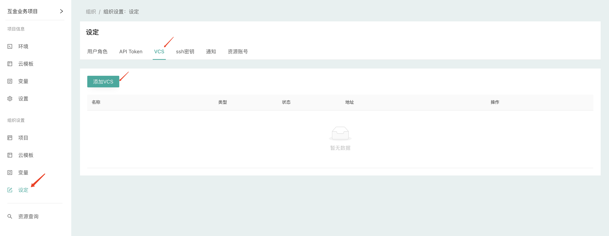
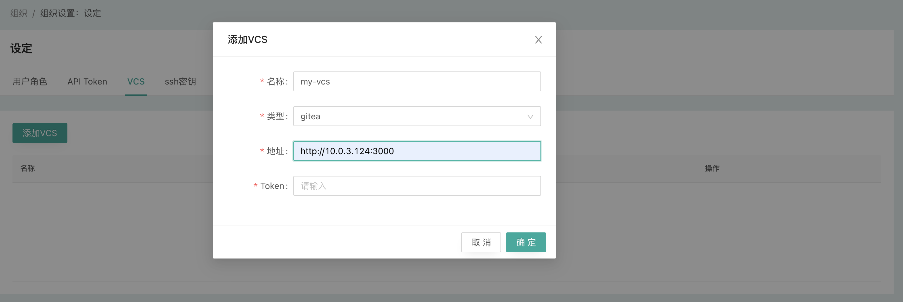
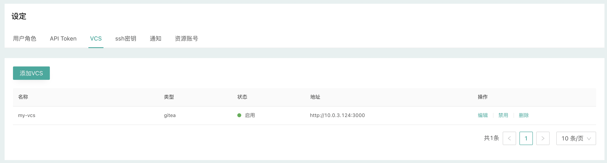

#### 添加VCS

CloudIaC中所有基础设施描述以及合规策略的代码都通过VCS（版本控制系统）进行管理，所以在创建组织后第一件事就是添加VCS集成，以便在创建云模板或合规策略时进行引用。

在『组织设定』-『VCS』页面选择『添加VCS』来添加集成

{.img-fluid}

{.img-fluid}

注：请确保您的token对应的帐号至少拥有对相应代码仓库的读取权限，如果您后续需要开启CI相关功能，还需要具有设置相应代码仓库webhook的权限

{.img-fluid}