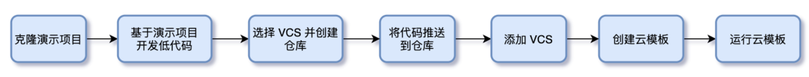

# 云模板开发文档

## 开发流程



## 平台地址

下面使用 http://cloudiac.example.com/ 进行演示说明。

## 登录用户名、密码

使用注册时填写的邮箱和密码直接登录，如果是组织管理员为您创建的用户，创建完成后登录信息将会邮件发送到您的邮箱

## 获取演示模板

cloudiac 部署后自带一个演示模板，可以基于该模板进行开发。

```shell
# git clone http://cloudiac.example.com/repos/cloud-iac/cloudiac-example.git
```

## 目录结构规范

```text
.
├── README.md       # 项目说明文档(必选)
├── main.tf         # terraform 主配置文件(必选)
├── versions.tf     # 指定依赖的 providers 及其版本(必选)
├── variables.tf    # input 变量定义(必选)
├── outputs.tf      # output 变量定义(必选) 
├── ansible         # ansible 相关资源目录(可选)
│   ├── playbook.yml    # ansible playbook
│   └── index.html      # playbook 中使用的文件
├── qa-env.tfvars    # QA 环境 tfvars(可选)
├── prod-env.tfvars  # 生产环境 tfvars(可选)
```

- "必选" 只表示文件必须存在，但内容可以为空
- 更详细的说明见 cloudiac-example 项目的 README

## 低代码开发

您可以在 cloudiac-example 项目基础上修改，或者创建一个全新项目，但**必须符合以上目录结构规范**。

下面以基于 cloudiac-example 开发为例演示模板开发过程：

1.  基于 cloudiac-example 创建项目

```shell
# mv cloudiac-example tf-webapp
# cd tf-webapp 
# rm -rf .git && git init .
```

2.  进行云模板开发，并提交代码

```shell
# git add .
# git commit -m "Initial commit"
```

3.  创建远程仓库
    选择一个熟悉的 vcs 服务，在其上新建一个代码库。
    目前 CloudIaC 支持的 VCS 类型有: GitLab、GitHub、Gitee、Gitea。
    
4.  将代码推送到远程仓库
    

```shell
# git remote add origin https://github.com/my/tf-webapp
# git push origin master
```

## 基于云模板部署环境

#### 添加 VCS

CloudIaC 平台通过 VCS 来访问代码仓库，在添加『云模板』前需要先将使用的 VCS 添加到平台。

1.  登录 CloudIaC 平台，选择所在组织，在『组织设置』-『设定』页面中选择『VCS』；
2.  点击『添加 VCS』，在弹出的页面中填写必要信息，然后保存。

#### 创建云模板

1.  进入『组织设置』-『云模板』页面并选择『新建云模板』；
2.  在『基础设置』步骤输入云模板名称、描述，点击下一步；
3.  进入『选择仓库』步骤，选择上一步添加的 VCS，然后在仓库列表中选择 tf-webapp，选择分支或Tag；
4.  在『变量设置』步骤中，设置部署时需要传递的变量，您可以通过Terraform变量中的『导入』按钮来选择导入variables.tf中定义的变量，也可以选择代码仓库中预定义的tfvars文件，如果您需要使用ansible来部署应用，可以在其他变量中选择相应的playbook文件；
5.  最后选择您要将该云模板关联到哪些项目，关联后的项目将可以看到该云模板，并基于该云模板部署环境；

---
- 注1：一个仓库可能覆盖多种场景，创建的云模板对应的场景建议在描述中加以说明，方便用户使用
- 注2：『Terraform 变量部分』会自动解析出 **variables.tf** 文件中的变量名称、默认值、描述，在添加时可进行选择

#### 部署环境

1.  进入『项目信息』-『云模板』页面，可以看到与该项目关联的云模板，选择相应的云模板，点击『部署』即可发起环境部署操作；
2.  在环境部署页面中，可以看到云模板定义的变量以及组织、项目下定义的变量，您可以对继承的变量进行重新赋值，也可以添加新的变量；
3.  输入环境名称，选择该环境的『存活时间』、『管理密钥』、『部署通道』等信息，点击页面下方的『执行部署』即可发起环境的部署；
4.  通过『部署日志』，您可以实时查看部署时的日志信息，了解部署实际进展；
5.  部署完成后，进入环境的详情页面即可查看该环境的基础信息、资源、输出等详细信息。
